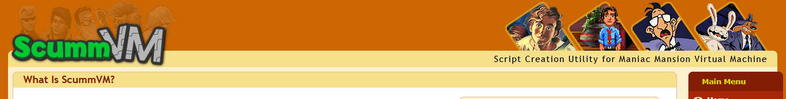

## About the Project
This project tested our ability to inspect, understand, and construct key architecture for a large software project. 
Given an open-source project, we had three objectives:
1. Using the wealth of documentation and reference architectures, derive a conceptual architecture for the software.
2. By viewing the source code, construct a concrete architecture and analyze its differences.
3. Suggest and design an architectural enhancement for the project.

For our year, the open-source project in question was **ScummVM**, a tool that re-creates and replaces the executables for
many old adventure and point-and-click games, enabling them to be played on non-native environments provided only the original
game files. You can learn more about ScummVM [here](https://www.scummvm.org/). In addition, we were also tasked with
examining the architecture of a particular subsystem: the **SCI game engine**.

We made use of official ScummVM and SCI wikis
to form the conceptual architecture, and relied on the Understand tool visualize dependency graphs between the various code modules
for the concrete architecture. These architectures are expressed through box-and-line diagrams, and specific use cases
are illustrated via sequence diagrams.

This project was completed as a part of *CISC322/326: Software/Game Architecture* at Queen's University. 
We delievered three detailed reports and 
video presentations, focusing on each of the three objectives. Reports and presentation slides are available in this 
repository, as well as our project website: [The Queen's Bees](https://nasreenmir06.github.io/queensbees/#a1).
The presentation videos can be viewed here:
- [Conceptual Architecture](https://drive.google.com/file/d/1lB1F-s53sEy7AYgfC4dbu62wrzjpFZP5/view)
- [Concrete Architecture](https://drive.google.com/file/d/10vyVWKhZQuWoTSg6qtGpZEr9Pc0lDDvm/view)
- [Architectural Enhancement](https://drive.google.com/file/d/1kXdq-cBlybVMBoqo1cDoGA80Zsxd5KG1/view)

As the team lead for our group of six students, I organized and hosted weekly meetings to keep the project on track. I also made sure to be 
knowledgable about the software so that my teammates could rely on me as a resource.
